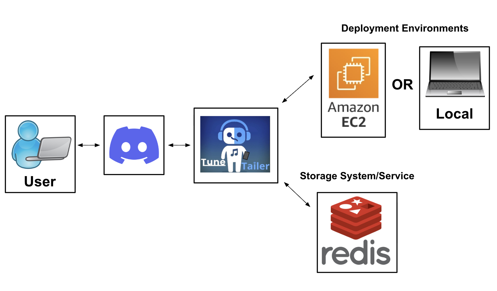
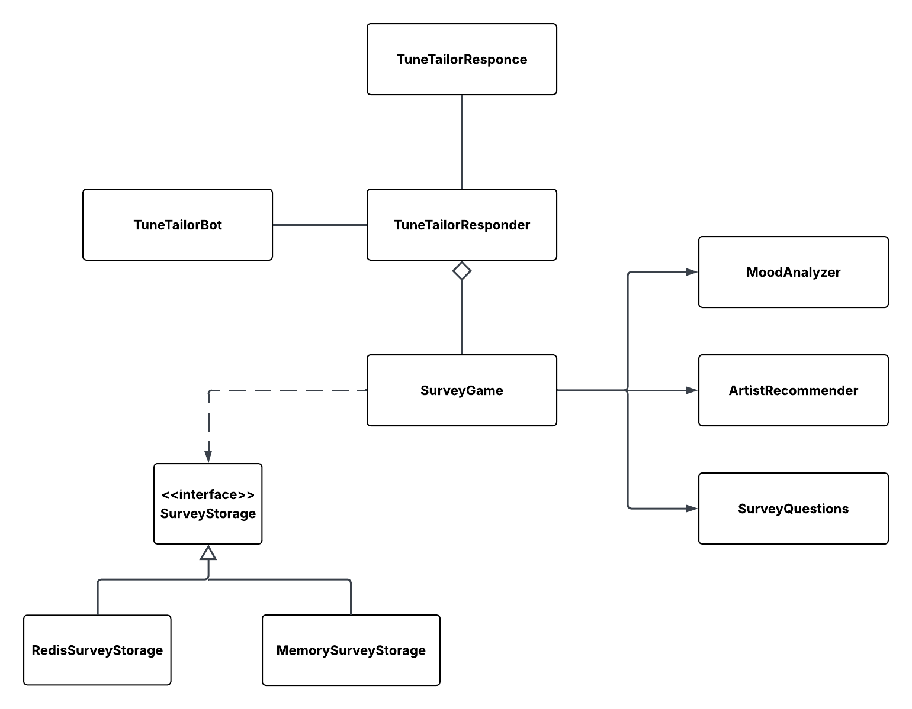

# TuneTailor Discord Bot

Author: Ryan Demarest, Andrew Kelleman, Clannys Alvarez  
Course: CSCI 220 Introduction to DevOps  
Institution: Moravian University

---

## CI/CD Status

| Workflow | Status |
|---------|--------|
| Tests |  |
| Deploy |  |
| Style |  |

---

## Project Overview

TuneTailor is a Discord bot that provides music recommendations based on a short interactive survey.

Users can:
- Take a solo survey
- Take a pair survey with another user

The bot analyzes responses to determine mood and returns recommended artists.

The system runs through Discord, uses Redis for storage, and includes an automatic memory fallback for reliability.

---

## Features

- Interactive Discord bot
- Solo and pair survey modes
- Mood based recommendations
- Redis data storage
- Memory fallback system
- AWS EC2 deployment
- CI/CD pipeline using GitHub Actions
- Code quality enforcement with Checkstyle

---

## System Architecture

### External System Architecture

---

### Internal System Architecture (UML)

---

## Main Components

- TuneTailorBot: Entry point and bot startup
- TuneTailorResponder: Handles Discord input
- TuneTailorResponses: Formats output messages

- SurveyGame: Controls survey logic
- SurveyStorage: Storage interface

- RedisSurveyStorage: Persistent storage
- MemorySurveyStorage: Fallback storage

- MoodAnalyzer: Determines mood
- ArtistRecommender: Suggests artists
- SurveyQuestions: Defines survey questions

---

## Data Storage (Redis)

Redis is used as the primary data store.

### Data Types Used

- String keys for flags and indexes
- Hash maps for survey answers

### Solo Survey Keys

- solo:active:<userId>
- solo:paused:<userId>
- solo:index:<userId>
- solo:answers:<userId>

### Pair Survey Keys

- pair:active
- pair:paused
- pair:index
- pair:turn
- pair:user1
- pair:user2
- pair:answers:1
- pair:answers:2

### Reliability

If Redis fails:
- The system switches to MemorySurveyStorage
- The bot continues running
- No crash occurs

---

## Build Process

We use Maven to build the project.

Pipeline:
compile -> test -> package

Output:
- Executable jar file used for deployment

---

## Secrets Management

Sensitive data such as the Discord token is stored using AWS Secrets Manager.

Fallback:
- A .env file is used if AWS Secrets is unavailable

---

## Deployment

### Local Setup

#### 1. Create a `.env` file

In the root of the project, create a file named `.env`:

Make sure it is also stored in the `.gitignore`

In the env add: `DISCORD_TOKEN=<your_token_here>`

---

#### 2. Start Redis

Make sure Redis is installed and running.

On Linux or Mac:
 `"redis-server"`

On Windows (if using WSL):
`"redis-server"`

---

#### 3. Build the project

From the project root: run `mvn clean package`

---

#### 4. Run the bot

After the build completes, run:`java -jar target/greetingbot-1.0.0-jar-with-dependencies.jar`

---

### EC2 Deployment

#### 1. Launch an EC2 instance

- Use AWS Web Server (Learner Lab)
- Choose a valid key pair (vokey)
- Ensure security group allows:
    - Port 22 (SSH)
    - Port 80 (HTTP)

---

#### 2. Configure instance details

- Under **Advanced Details**
    - Attach IAM role: `LabInstanceProfile`
    - Upload the `userdata.sh` script

---

#### 3. Start the instance

After launching:
- Wait 2 to 3 minutes for initialization
- The userdata script will run automatically

---

#### 4. What userdata.sh does

The script performs the following steps:

- Installs required packages:

`sudo yum install -y git maven-amazon-corretto21 redis6`

- Starts Redis:

`sudo systemctl enable redis6`

`sudo systemctl start redis6`

- Clones the repository:
`git clone https://github.com/cs220s26/TuneTailor-Deployment-220.git`
`cd TuneTailor-Deployment-220`

Build the project (skipping the tests):
`mvn clean package -DskipTests`

- Starts the bot using systemd

---
## System Service

The bot runs as a systemd service.

Service file: `tunetailorbot.service`

Key behavior:

- Automatically starts on system boot
- Restarts if the bot crashes
- Runs continuously in the background

Useful commands:

Check status:

`sudo systemctl status tunetailorbot`

Restart service

`sudo systemctl restart tunetailorbot`

View logs:

`journalctl -u tunetailorbot`

Enable on startup:

`sudo systemctl enable tunetailorbot`

Reload systemd after changes:

`sudo systemctl daemon-reload`

## CI/CD Pipeline

GitHub Actions automates:

1. Running tests
2. Checking code style
3. Deploying to EC2

Workflow:
- Push code
- Run pipeline
- Deploy if successful

---

## Scripts

Scripts are used for:

- Redis test data
- Resetting the database
- Redeploying the application

---

## Commands

- !help
- !survey
- !pairsurvey
- !join
- !pause solo
- !resume solo
- !pause pair
- !resume pair
- !stop

---

## Lessons Learned

- AWS permissions must be configured correctly
- Automation reduces manual work
- Redis fallback improves reliability
- CI/CD ensures stable deployment

---
## Spotify Artist Getter (separate from program)
### (should not be needed, but if you wanted a fresh list in the .txt)

** if you wanted to use this, you need to put these in your .env

`SPOTIFY_CLIENT_ID = "your client id"`

`SPOTIFY_CLIENT_SECRET = "client secret code"`

* Then just run the script
---

## Conclusion

TuneTailor is a fully automated Discord bot system.

It demonstrates:
- Cloud deployment
- CI/CD pipelines
- Automated infrastructure
- Reliable data handling

The system is stable, scalable, and production ready.